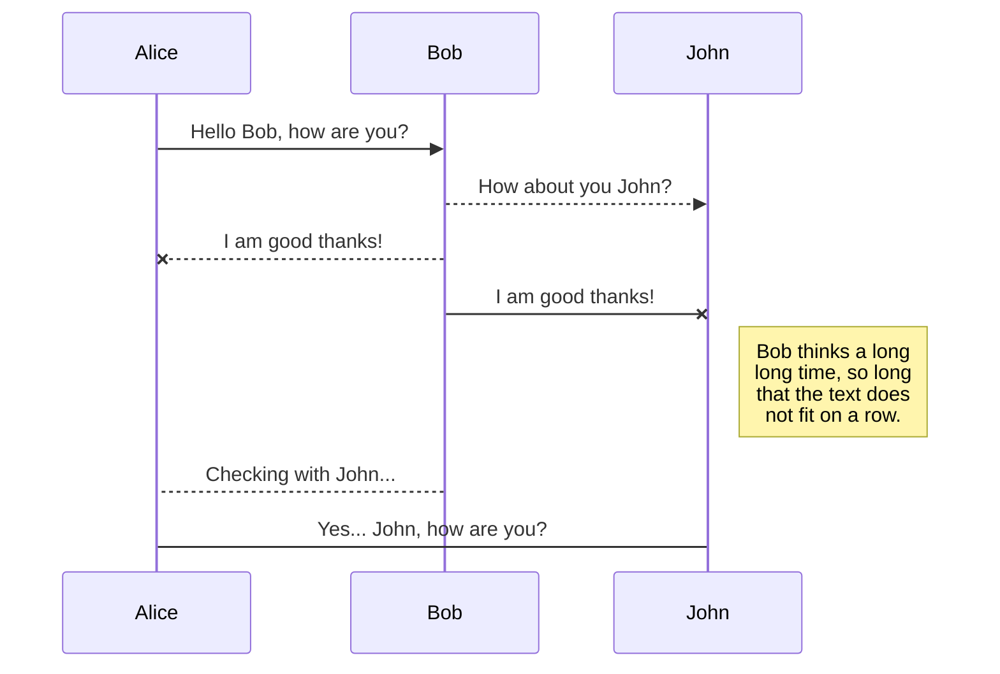

# Welcome to StackEdit!

Hello this post is to test the features of  **Jeykll**.

> Hopefully this page will demonstrate lots of
useful features.

| Tables        | Are           | Cool  |
| ------------- |:-------------:| -----:|
| col 3 is      | right-aligned | $1600 |
| col 2 is      | centered      |   $12 |
| zebra stripes | are neat      |    $1 |

### H3 Heading

Bulleted List:
* first
* second

Numbered List:
1. first
2. second

Inline Maths: $$x^5$$ as seen.

$$\vec{F_{12}} = k_{elec} \frac{q1 q2}{r_{12}}\hat{r_{12}}$$

Where $$k_{elec}$$ $$\implies$$ Permittivity of free space. Hence;

$$k_{elec}= \frac{1}{4\pi\epsilon_0}$$

Inline Code `x+y`

Python code block:

```Python
  import numpy as np

  def test_function(x,y):
    z= np.sum(x,y)
    return z
```

An image:

{:class="img-responsive"}

End.

# Markdown extensions

StackEdit extends the standard Markdown syntax by adding extra **Markdown extensions**, providing you with some nice features.

> **ProTip:** You can disable any **Markdown extension** in the **File properties** dialog.


## SmartyPants

SmartyPants converts ASCII punctuation characters into "smart" typographic punctuation HTML entities. For example:

|                |ASCII                          |HTML                         |
|----------------|-------------------------------|-----------------------------|
|Single backticks|`'Isn't this fun?'`            |'Isn't this fun?'            |
|Quotes          |`"Isn't this fun?"`            |"Isn't this fun?"            |
|Dashes          |`-- is en-dash, --- is em-dash`|-- is en-dash, --- is em-dash|


## KaTeX

You can render LaTeX mathematical expressions using [KaTeX](https://khan.github.io/KaTeX/):

The *Gamma function* satisfying $\Gamma(n) = (n-1)!\quad\forall n\in\mathbb N$ is via the Euler integral

$$
\Gamma(z) = \int_0^\infty t^{z-1}e^{-t}dt\,.
$$

> You can find more information about **LaTeX** mathematical expressions [here](http://meta.math.stackexchange.com/questions/5020/mathjax-basic-tutorial-and-quick-reference).


## UML diagrams

You can render UML diagrams using [Mermaid](https://mermaidjs.github.io/). For example, this will produce a sequence diagram:



And this will produce a flow chart:
